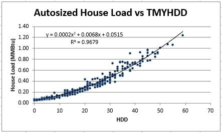
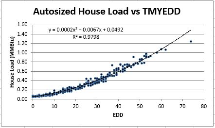
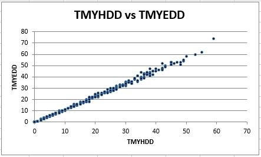

## Test house

The house selected is the residential single-family house-on-slab, gas furnace and other appliances, IECC 2006.  This first run is with autosizing on and Boston TMY data.  Below, the results are summarized by gas day (10am - 10am).

## Daily house gas requirements vs. HDD

Hourly gas usage is summed to the gas day.  Daily HDDs are calculated as the mean of the hourly HDD values, rounded to zero decimal places.  The load fits a degree-2 polynomial nicely.

## Daily house gas requirements vs. EDD

Hourly gas usage is summed to the gas day.  Daily EDDs are calculated as the mean of the hourly EDD values, rounded to zero decimal places.  Since EDD incorporates wind speed, it provides a slightly better fit.  Again, the load fits a degree-2 polynomial nicely with a slight improvement in the r-squared.

The design day, which fell nicely on the curve of load vs. HDD suddenly deviates from the curve.

## HDD vs. EDD

The load deviation is driven by the deviation of the peak day EDD from the EDD-to-HDD line.

